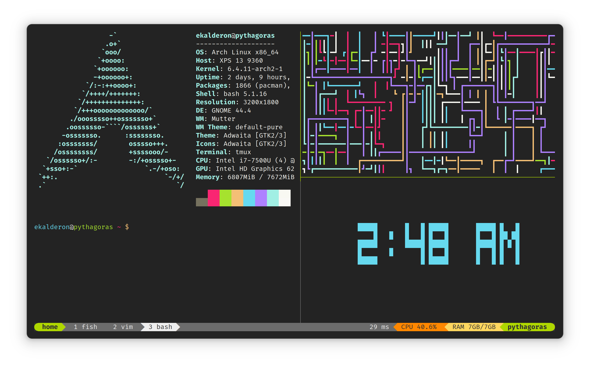

# Monokai Classic for [tmux](https://github.com/tmux/tmux/wiki)

> A customized version of the [Dracula](https://github.com/dracula/tmux) theme
> for [tmux](https://github.com/tmux/tmux/wiki) using the Monokai color palette.



## Install

Using [tpm](https://github.com/tmux-plugins/tpm), add the following to your `.tmux.conf`:

```
set -g @plugin 'ebkalderon/tmux-monokai-classic'
```


## Configuration

Configuration and options can be found at [draculatheme.com/tmux](https://draculatheme.com/tmux).

**Note:** Replace all mentions of `@dracula` with `@monokai`.

## Features

- Support for powerline
- Day, date, time, timezone
- Current location based on network with temperature and forecast icon (if available)
- Network connection status, bandwidth and SSID
- SSH session user, hostname and port of active tmux pane
- Git branch and status
- Battery percentage and AC power connection status
- Refresh rate control
- CPU usage (percentage or load average)
- RAM usage (system and/or tmux server)
- GPU usage
- Custom status texts from external scripts
- GPU VRAM usage
- GPU power draw
- Color code based on whether a prefix is active or not
- List of windows with the current window highlighted
- When prefix is enabled, a smiley face turns from green to yellow
- When charging, 'AC' is displayed
- If forecast information is available, a ☀, ☁, ☂, or ❄ unicode character corresponding with the forecast is displayed alongside the temperature
- Info if the Panes are synchronized
- Spotify playback (needs the tool spotify-tui installed)
- Music Player Daemon status (needs the tool mpc installed)
- Current kubernetes context
- Countdown to tmux-continuum save
- Current working directory of tmux pane

## Compatibility

Compatible with macOS and Linux. Tested on tmux 3.3a on Arch Linux.

## License

[MIT License](./LICENSE)

## Credits

All credit goes to [dracula/tmux](https://github.com/dracula/tmux), from which
this theme was forked.

[maxpetretta/tmux-monokai-pro](https://github.com/maxpetretta/tmux-monokai-pro)
deserves an honorable mention for the status line design.

Special thanks to [Monokai](https://monokai.nl/) for creating the color palette
of the same name.
